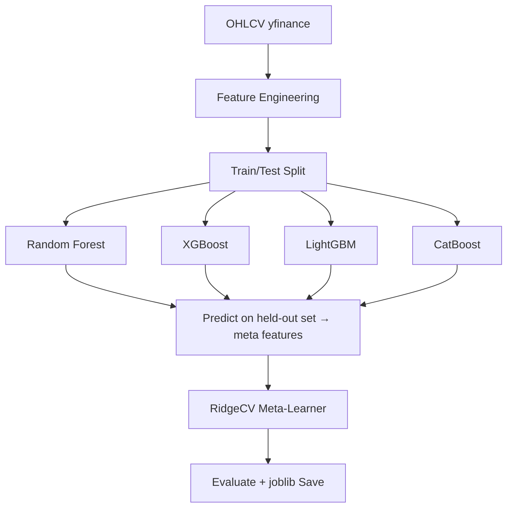

# Phase 19: Optional Quant ML Agent + Device Selection — Research

## 4-Model Stacking Ensemble Approach

**Layer 1 (Base models):** Random Forest (bagging) + XGBoost + LightGBM + CatBoost (boosting).
**Layer 2 (Meta-learner):** RidgeCV — learns optimal model weights via cross-validation.

### Why Stacking + RidgeCV?

| Yöntem | Problem | Stacking Çözümü |
|--------|---------|----------------|
| Weighted voting | Ağırlıkları elle belirlemek zor, hangi model daha iyi bilinmez | RidgeCV CV ile optimum katsayıları öğrenir |
| Simple averaging | Kötü model iyi modeli aşağı çeker | Ridge düşük performanslı modele düşük weight verir |
| Manual tuning | Her veri setinde farklı ağırlık gerekir | Data-driven, her eğitimde otomatik optimize olur |

### Training Pipeline



### Inference

```
OHLCV → Features → Scale → 4 base models predict
  → Stack predictions as N×4 matrix
  → RidgeCV meta-learner → final BUY/SELL/HOLD + confidence
```

### Dependencies

| Library | Purpose | Size |
|---------|---------|------|
| scikit-learn | RandomForest, Scaler, Voting | ~15MB |
| xgboost | XGBClassifier | ~25MB |
| lightgbm | LGBMClassifier | ~10MB |
| catboost | CatBoostClassifier | ~30MB |
| joblib | Model persistence | built-in |
| snakemake | Pipeline orchestration | ~5MB |

All are optional deps (`uv sync --group quant`). Core install stays lean.

### Features (from OHLCV)

- Returns: 1d, 5d, 21d
- Volatility: 5d, 21d rolling std
- Price ratios: close/high, close/low, high/low
- Indicators: RSI(14), MACD(12,26,9), Bollinger %b, SMA20/50 ratio
- Volume: volume ratio (vs 21d avg), volume price trend
- Rolling: min/max/mean of close over 5d, 21d

### Device Selection

auto / cpu / mps / cuda

Tree-based modeller için device selection çok kritik değil (hepsi CPU'da hızlı).
Generic device resolver API'si tutuluyor, PyTorch deep learning opsiyonu için genişletilebilir.

### Output

```python
{
    "signal": "BUY" | "SELL" | "HOLD",
    "confidence": 0.0-1.0,
    "reasoning": "Top 3 features: ...",
    "top_features": {"rsi_14": 0.25, "return_21d": 0.18, "volatility_21d": 0.12},
    "model_version": "rf+xgb+lgbm+cb_v1",
    "device": "cpu",
    "latency_ms": 45.2
}
```
