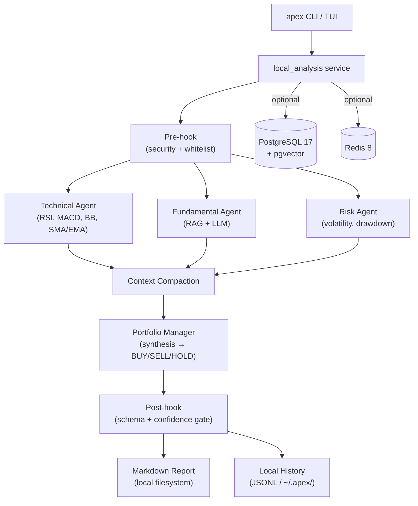

# Apex Terminal

**Local-first multi-agent market research cockpit for the terminal.**

4 specialized LangGraph agents (Technical, Fundamental, Risk, Portfolio Manager) analyze stocks and produce BUY/SELL/HOLD signals with confidence scores — all running locally, no server required.

[](https://github.com/EnesDemir143/apex/actions/workflows/ci.yml)
[](https://www.python.org/)
[](LICENSE)
[](https://langchain-ai.github.io/langgraph/)
[](https://textual.textualize.io/)

---

## Quickstart

```bash
# 1. Clone and install
git clone https://github.com/your-org/apex.git
cd apex
uv sync

# 2. Set your API keys
cp .env.example .env
# edit .env: OPENAI_API_KEY, ALPACA_API_KEY, ALPACA_SECRET_KEY

# 3. Launch the terminal cockpit
uv run apex

# — or run a one-shot analysis —
uv run apex analyze AAPL
```

No PostgreSQL, Redis, or Docker required for local use.

---

## What Apex Does

```
uv run apex                    # open the Textual terminal cockpit
uv run apex analyze AAPL       # one-shot analysis (dev/classic mode)
uv run apex report AAPL        # view latest saved report
uv run apex history            # list previous local runs
uv run apex backtest AAPL      # replay signals against historical data
```

Each analysis run:
1. Fetches OHLCV market data (Alpaca primary, yfinance fallback)
2. Runs 4 agents in parallel: Technical → Fundamental → Risk → Portfolio Manager
3. Produces a BUY/SELL/HOLD signal with confidence score and per-agent reasoning
4. Optionally saves a structured markdown research report locally

---

## Project Direction

Apex started as a production-style multi-agent trading dashboard with FastAPI, Streamlit, PostgreSQL, Redis, and K8s deployment manifests. After evaluating hosting cost, API-key economics, and the need for a stronger portfolio demo, the project pivoted to a **local-first terminal cockpit**.

The existing web/API stack is preserved as an optional extension (see [Optional: Web Stack](#optional-web-stack-fastapi--streamlit)). The primary experience is now a TUI/CLI workflow that runs specialized LangGraph agents, streams their progress, and exports structured research reports locally.

> If you want to revive the full web/API/Streamlit stack, see [docs/WEB_STACK_REVIVAL_GUIDE.md](docs/WEB_STACK_REVIVAL_GUIDE.md) (Phase 16).

---

## Architecture



### Key Components

| Layer | Technology | Purpose |
|-------|-----------|---------|
| CLI / TUI | Typer + Textual | Terminal cockpit and classic commands |
| Agents | LangGraph 1.1 | 4-node StateGraph with parallel execution |
| LLM | GPT-5.4 mini | Agent reasoning (configurable) |
| Embeddings | Nomic Embed Text V2 | RAG pipeline, 768-dim |
| Market Data | Alpaca (alpaca-py) + yfinance fallback | OHLCV bars |
| Local History | JSONL + filesystem | Analysis runs, reports — no DB required |
| API (optional) | FastAPI 0.136 | REST endpoints for server/web mode |
| Database (optional) | PostgreSQL 17 + pgvector | OHLCV, analysis runs, embeddings |
| Cache (optional) | Redis 8 | LLM response cache, circuit breaker |
| Frontend (optional) | Streamlit 1.56 | Legacy AI market intelligence cockpit |
| Observability (optional) | OTel + Grafana LGTM | Traces, logs, metrics |
| Deployment (optional) | K3s v1.34 + Kustomize | ARM64 self-hosted Kubernetes |

---

## Environment Variables

Copy `.env.example` to `.env` and configure:

```bash
# LLM (required)
OPENAI_API_KEY=sk-...
LLM_MODEL=gpt-4o-mini
LLM_DAILY_BUDGET_USD=5.0

# Market data (required for live data; yfinance fallback works without)
ALPACA_API_KEY=...
ALPACA_SECRET_KEY=...

# Embeddings
EMBEDDING_MODEL=nomic-embed-text-v2
EMBEDDING_DIM=768

# LangSmith (optional tracing)
LANGCHAIN_API_KEY=...
LANGCHAIN_PROJECT=apex

# Database (optional — only needed for API/web mode)
POSTGRES_USER=apex
POSTGRES_PASSWORD=apex
POSTGRES_HOST=localhost
POSTGRES_PORT=5432
POSTGRES_DB=apex

# Redis (optional — only needed for API/web mode)
REDIS_URL=redis://localhost:6379/0
```

---

## Development Workflow

```bash
# Run all checks (ruff + mypy + pytest)
make check

# Run only tests
uv run pytest

# Run E2E tests (requires Docker)
uv run pytest tests/e2e/ -v

# Lint / format
uv run ruff check src/ tests/
uv run ruff format src/ tests/

# Type check
uv run mypy src/
```

---

## Project Structure

```
apex/
├── src/apex/
│   ├── cli/            # Typer app entrypoint + commands
│   ├── tui/            # Textual terminal cockpit
│   ├── agents/         # LangGraph nodes, workflow, hooks, resilience
│   ├── services/       # local_analysis, LLM client, cost guard, cache, RAG, DLQ
│   ├── reports/        # Markdown report generation
│   ├── core/           # Config, logging, constants, exceptions
│   ├── domain/         # Pydantic domain models and value objects
│   ├── ingestion/      # Alpaca + yfinance market data clients
│   ├── infrastructure_layer/  # SQLAlchemy ORM models, DB/Redis factories
│   ├── api/            # FastAPI app, routes, middleware (optional/legacy)
│   └── frontend/       # Streamlit cockpit (optional/legacy)
├── tests/
│   ├── unit/           # Fast unit tests (no I/O)
│   ├── integration/    # Tests with real containers
│   └── e2e/            # Full pipeline E2E tests
├── migrations/         # Alembic async migrations
├── k8s/                # Kustomize base + overlays (optional)
├── scripts/            # Backup, restore, seed scripts
└── docs/               # ADRs, deployment runbook, web revival guide
```

---

## Optional: Web Stack (FastAPI + Streamlit)

The full server stack is preserved for CV/portfolio demonstration and optional production use. It is not required for local TUI operation.

### Start the full stack

```bash
# Start infrastructure (PostgreSQL, Redis, Grafana LGTM)
docker compose -f docker-compose.dev.yml up -d

# Run database migrations
uv run alembic upgrade head

# Seed initial data
uv run python scripts/seed_data.py

# Start the API server
uv run uvicorn apex.api.app:create_app --factory --reload

# Start the Streamlit frontend (separate terminal)
uv run streamlit run src/apex/frontend/app.py
```

### API Reference

| Method | Path | Description |
|--------|------|-------------|
| GET | `/health` | Liveness probe |
| GET | `/ready` | Readiness probe |
| POST | `/api/v1/analyze/{ticker}` | Run 4-agent workflow |
| GET | `/api/v1/ohlcv/{ticker}` | Return OHLCV bars |

### K3s Deploy

```bash
docker buildx build --platform linux/amd64,linux/arm64 \
  -t ghcr.io/your-org/apex:latest --push .
kubectl apply -k k8s/overlays/production/
```

See [docs/DEPLOYMENT_RUNBOOK.md](docs/DEPLOYMENT_RUNBOOK.md) for the full guide.
See [docs/WEB_STACK_REVIVAL_GUIDE.md](docs/WEB_STACK_REVIVAL_GUIDE.md) to re-integrate the web stack as a primary path.

---

## ADRs

- [ADR-001: LangGraph for agent orchestration](docs/adr/ADR-001-langgraph.md)
- [ADR-002: PostgreSQL + pgvector for data and embeddings](docs/adr/ADR-002-postgresql-pgvector.md)
- [ADR-003: Monolith-first architecture](docs/adr/ADR-003-monolith-first.md)
- [ADR-004: Redis 8 over Redis Stack](docs/adr/ADR-004-redis-8.md)

---

## License

MIT
