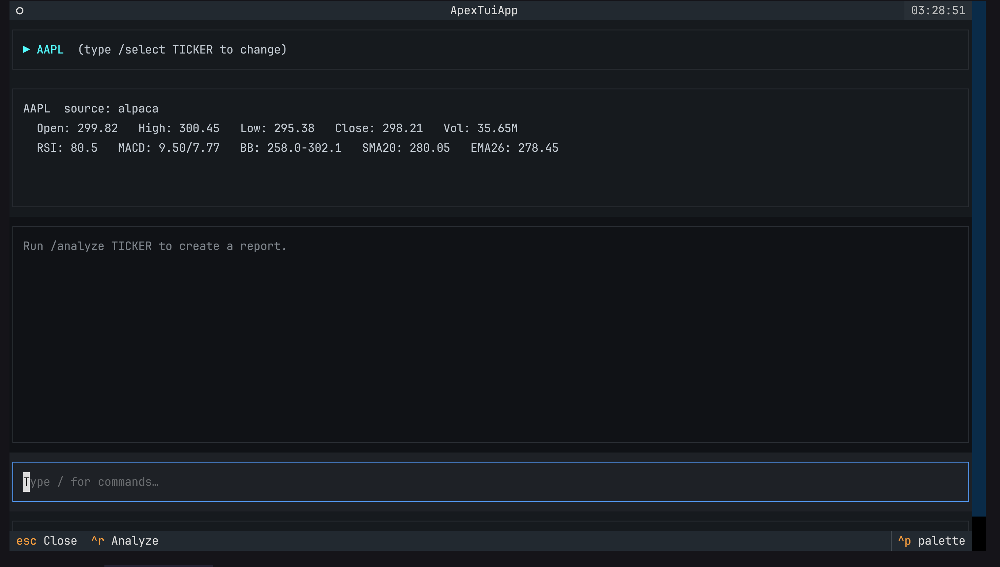
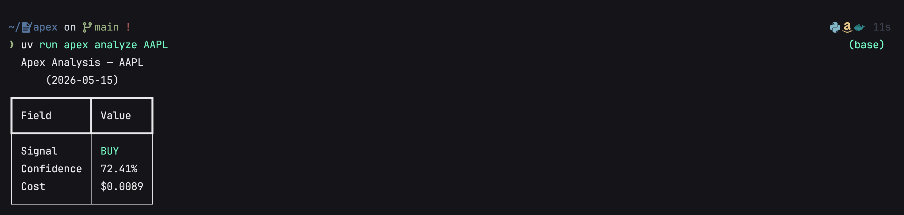
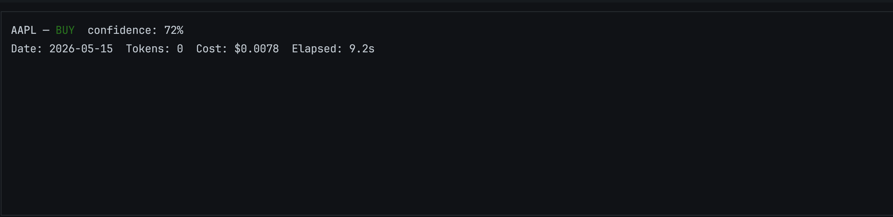
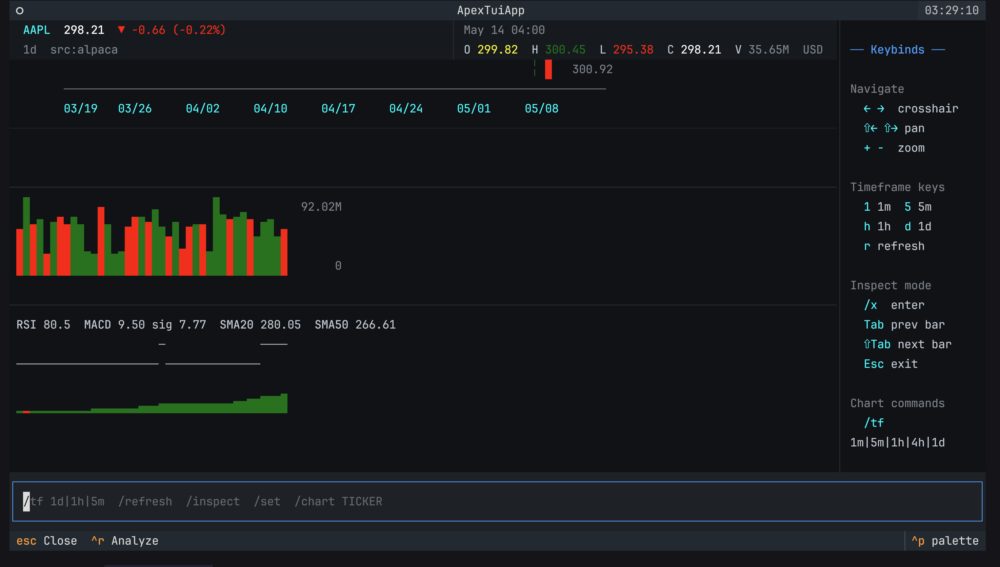
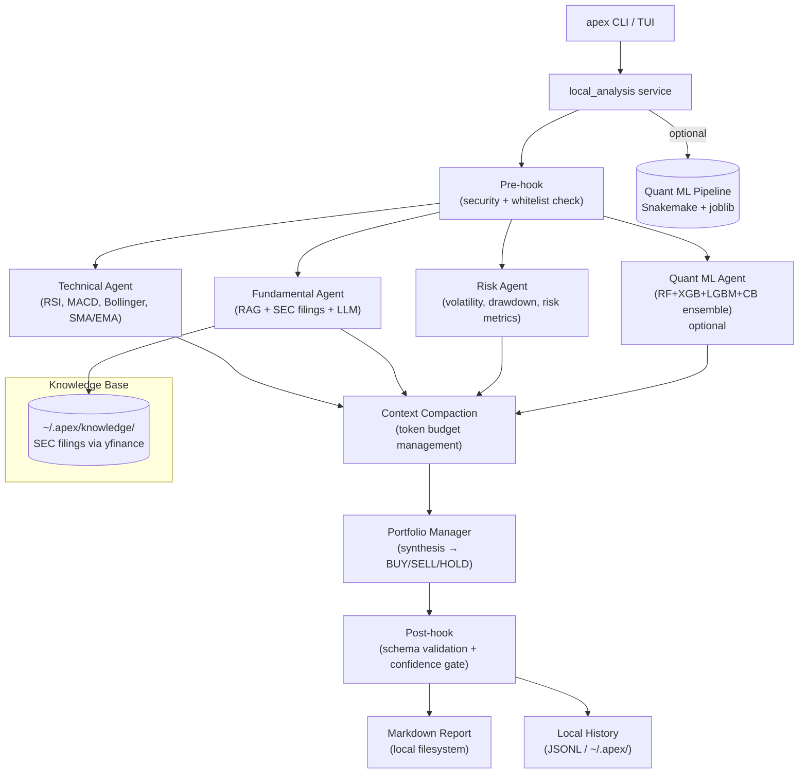

# Apex Terminal

> **Local-first multi-agent market research cockpit for the terminal.**

[](https://github.com/EnesDemir143/apex/actions/workflows/ci.yml)
[](https://www.python.org/)
[](LICENSE)
[](https://langchain-ai.github.io/langgraph/)
[](https://textual.textualize.io/)

<p align="center">
  
  <br>
  <em>4 LangGraph agents analyzing AAPL in real-time — Technical, Fundamental, Risk, Portfolio Manager</em>
</p>

---

**Want this in Turkish?** [Türkçe README](README.tr.md)

---

## Overview

Apex is a **local-first, multi-agent market research cockpit** that runs entirely in your terminal. It orchestrates **four specialized LangGraph agents** — Technical, Fundamental, Risk, and Portfolio Manager — to analyze stocks and produce BUY/SELL/HOLD signals with confidence scores. All agents run in parallel, with optional ensemble ML and RAG over SEC filings.

No cloud, no servers, no Docker required. Just your terminal and an OpenAI API key.

### Why Apex?

| Capability | What it demonstrates |
|-----------|---------------------|
| **Multi-Agent Orchestration** | LangGraph StateGraph with parallel execution, context compaction, and checkpoint persistence |
| **Ensemble ML Pipeline** | 4-model ensemble (RF + XGBoost + LightGBM + CatBoost) with RidgeCV stacking → `snakemake` training pipeline |
| **RAG over SEC Filings** | Downloads 10-K/10-Q reports via yfinance, converts to markdown, serves through local knowledge retrieval |
| **Resilience Patterns** | Circuit breaker, rule-based fallback, exponential backoff retry, dead letter queue |
| **Terminal UI** | Full Textual TUI with candlestick charts, command palette, real-time agent progress |
| **Local-First Architecture** | No server, no database — runs on your machine with zero infrastructure |

---

<p align="center">
  
  <br>
  <em>One-shot analysis from the command line</em>
</p>

---

## Screenshots

| | |
|---|---|
|  |  |
| Analysis result with Quant ML signal | Terminal-native candlestick chart |
|  |  |
| TUI during agent execution | CLI one-shot analysis |

---

## Quickstart

```bash
# 1. Clone and install
git clone https://github.com/EnesDemir143/apex.git
cd apex
uv sync

# 2. Set your API keys
cp .env.example .env
# edit .env: set OPENAI_API_KEY

# 3. Launch the terminal cockpit
uv run apex

# — or run a one-shot analysis —
uv run apex analyze AAPL
```

No PostgreSQL, Redis, Docker, or web server required. Apex runs entirely locally.

---

## Architecture



### Agent Execution Flow

1. **Pre-hook**: Validates ticker whitelist, checks for prompt injection
2. **Parallel Execution**: Technical, Fundamental, Risk, and Quant agents run concurrently
3. **Context Compaction**: Compresses agent outputs when token budget is exceeded
4. **Portfolio Manager**: Synthesizes all outputs into a final decision
5. **Post-hook**: Validates output schema, applies rule-based fallback if needed

### Key Components

| Layer | Technology | Purpose |
|-------|-----------|---------|
| **CLI / TUI** | Typer + Textual | Terminal cockpit with slash commands, chart panel, market data |
| **Agent Orchestration** | LangGraph 1.1 | 4-node StateGraph with parallel execution, checkpointers, resilience |
| **LLM Reasoning** | GPT-4o-mini / configurable | Agent decision-making, configurable via settings or Ollama |
| **Ensemble ML** | scikit-learn + xgboost + lightgbm + catboost | Optional 4-model quant signal (RF, XGB, LGBM, CB + RidgeCV stacking) |
| **Training Pipeline** | Snakemake | Reproducible ML training: fetch → features → train → evaluate → persist |
| **RAG** | Local knowledge files + yfinance SEC filings | Fundamental agent context from real 10-K/10-Q reports |
| **Market Data** | Alpaca (alpaca-py) + yfinance fallback | OHLCV bars for analysis and training |
| **Local History** | JSONL + filesystem | Analysis runs and markdown reports — zero infrastructure |
| **API (optional)** | FastAPI | REST endpoints for server/web mode |
| **Database (optional)** | PostgreSQL 17 + pgvector | OHLCV storage, analysis persistence, embeddings |
| **Frontend (optional)** | Streamlit | Legacy market intelligence dashboard |
| **Deployment (optional)** | Docker + K3s + Kustomize | ARM64 self-hosted Kubernetes |

---

## Features

### Multi-Agent Orchestration

Four specialized LangGraph agents, each with its own system prompt and reasoning:

| Agent | Role | Analysis |
|-------|------|----------|
| **Technical** | Disciplined technical analyst | RSI, MACD, Bollinger Bands, SMA/EMA, volume analysis |
| **Fundamental** | Conservative equity analyst | RAG-based context from SEC filings, financial metrics |
| **Risk** | Risk manager | Volatility, drawdown, risk score, position sizing |
| **Portfolio Manager** | Synthesis supervisor | Aggregates all signals → BUY/SELL/HOLD + confidence + reasoning |

Run in parallel with **real-time progress tracking** — each agent's completion appears live in the event log.

### Ensemble ML Quant Agent (Optional)

A **4-model stacking ensemble** with RidgeCV meta-learner:

- **Base models**: Random Forest, XGBoost, LightGBM, CatBoost
- **Meta-learner**: RidgeCV with TimeSeriesSplit cross-validation
- **23 technical features**: Returns, volatility, RSI, MACD, Bollinger, SMA ratios, volume, rolling statistics
- **Training pipeline**: `snakemake -s Snakefile_train all --cores 4`
- **Model persistence**: joblib → `models/quant/*.pkl`

Enable via TUI: `/quant on` → `/analyze AAPL`. Portfolio Manager includes the quant signal when available.

### RAG over SEC Filings

```bash
# Download latest 10-K/10-Q filings for all tracked tickers
uv run apex sec-fetch all

# Downloaded files are automatically available to the Fundamental Agent
ls ~/.apex/knowledge/AAPL/
# 10-K_20251031.md  10-Q_20260130.md  10-Q_20260501.md
```

Filings are converted to clean markdown and served through the local knowledge retrieval system. No database, no embedding server.

### Terminal UI (Textual)

- **Slash command palette**: `/select`, `/analyze`, `/chart`, `/quant`, `/lang`, `/prompt`, `/help`
- **Real-time progress**: Each agent completion shown live in the event log
- **Candlestick charts**: Terminal-native chart with RSI/MACD sub-panels, crosshair inspection, zoom/pan
- **Market panel**: Live OHLCV, indicator summary, source tracking
- **Agent prompts**: `/prompt technical "focus on momentum"` — per-agent instruction customization

### Resilience & Safety

- **Pre-hook**: Input canonicalization, prompt injection detection, ticker whitelist
- **Post-hook**: Output schema validation, confidence threshold gate
- **Circuit breaker**: Failsafe after repeated LLM failures, rule-based fallback
- **LLM budget guard**: Daily cost tracking, automatic stop on budget exhaustion
- **Rule-based fallback**: RSI < 30 → BUY, RSI > 70 → SELL, RSI between → HOLD
- **Context compaction**: Compresses agent outputs when approaching token limit

### Observability

- **LangSmith tracing**: Every agent invocation traced with ticker + agent_name metadata
- **OpenTelemetry**: Optional FastAPI instrumentation for traces, logs, and metrics
- **Cost tracking**: Per-analysis token usage and cost in USD

---

## CLI Reference

```bash
uv run apex                    # Launch the terminal cockpit (default)
uv run apex analyze AAPL       # One-shot analysis
uv run apex analyze AAPL --save-report  # Save as markdown report
uv run apex history            # List saved analyses
uv run apex report AAPL --latest # View latest report
uv run apex sec-fetch AAPL     # Download SEC filings to knowledge base
uv run apex sec-fetch all      # Download for all whitelist tickers
```

### TUI Slash Commands

| Command | Description |
|---------|-------------|
| `/select AAPL` | Change selected ticker |
| `/analyze AAPL` | Run analysis for ticker |
| `/chart AAPL` | Open terminal chart |
| `/quant on` | Enable Quant ML agent |
| `/lang Turkish` | Switch report language |
| `/prompt` | View/set agent instructions |
| `/setup` | Open configuration panel |
| `/team` | View agent team screen |
| `/help` | List all commands |

---

## Installation

### Prerequisites

- Python 3.13+
- `uv` (Python package manager) — install via `curl -LsSf https://astral.sh/uv/install.sh | sh`
- OpenAI API key

### Setup

```bash
# Clone
git clone https://github.com/EnesDemir143/apex.git
cd apex

# Install core dependencies
uv sync

# (Optional) Install Quant ML dependencies
uv sync --group quant

# (Optional) Train ensemble models
bash scripts/train_models.sh
# or: snakemake -s Snakefile_train all --cores 4

# Configure environment
cp .env.example .env
# Edit .env:
#   OPENAI_API_KEY=sk-...            (required)
#   ALPACA_API_KEY=...               (optional — yfinance fallback works without)
#   ALPACA_SECRET_KEY=...

# Launch
uv run apex
```

### Development

```bash
# Run all checks
make check

# Run tests
uv run pytest tests/unit/

# Format and lint
uv run ruff format src/ tests/
uv run ruff check src/ tests/

# Type check
uv run mypy src/
```

---

## Project Structure

```
apex/
├── src/apex/
│   ├── cli/                    # Typer CLI entrypoint + commands
│   ├── tui/                    # Textual terminal cockpit
│   ├── agents/                 # LangGraph nodes, workflow, hooks, resilience
│   │   ├── technical.py        #   Technical Agent (indicators)
│   │   ├── fundamental.py      #   Fundamental Agent (RAG + LLM)
│   │   ├── risk.py             #   Risk Agent (metrics + assessment)
│   │   ├── portfolio_manager.py#   Portfolio Manager (synthesis)
│   │   ├── quant.py            #   Quant ML Agent (ensemble)
│   │   ├── workflow.py         #   StateGraph assembly + streaming
│   │   └── state.py            #   AgentState TypedDict
│   ├── ml/                     # Quant ML inference package
│   │   ├── features.py         #   23-feature extractor
│   │   ├── model_registry.py   #   Model loading + ensemble prediction
│   │   └── device.py           #   Device resolver (auto/cpu/mps/cuda)
│   ├── services/               # Core services
│   │   ├── local_analysis.py   #   Server-independent analysis runner
│   │   ├── sec_filings.py      #   SEC filing download via yfinance
│   │   ├── market_snapshot.py  #   OHLCV + indicator snapshot
│   │   ├── llm_client.py       #   LLM client abstractions
│   │   ├── history_store.py    #   JSONL-backed local history
│   │   └── ...                 #   Cost guard, cache, RAG, DLQ, sanitizer
│   ├── reports/                # Markdown report generation
│   ├── core/                   # Config (Pydantic Settings), logging, constants
│   ├── domain/                 # Pydantic domain models + value objects
│   ├── ingestion/              # Alpaca + yfinance market data clients
│   ├── infrastructure_layer/   # SQLAlchemy ORM, DB/Redis factories
│   ├── api/                    # FastAPI app (optional/legacy)
│   └── frontend/               # Streamlit cockpit (optional/legacy)
├── tests/
│   ├── unit/                   # 193 fast unit tests
│   ├── integration/            # Container-based tests
│   └── e2e/                    # Full-pipeline end-to-end
├── models/quant/               # Trained ensemble models
├── Snakefile_train             # Snakemake training pipeline
├── scripts/                    # Training, backup, seed scripts
└── docs/                       # ADRs, deployment, web revival guide
```

---

## Optional: Web Stack (FastAPI + Streamlit)

The full server stack is preserved for CV demonstration. Not required for local TUI operation.

```bash
docker compose -f docker-compose.dev.yml up -d
uv run alembic upgrade head
uv run uvicorn apex.api.app:create_app --factory --reload
```

See [docs/WEB_STACK_REVIVAL_GUIDE.md](docs/WEB_STACK_REVIVAL_GUIDE.md) for details.

---

## Environment Variables

| Variable | Required | Default | Description |
|----------|----------|---------|-------------|
| `OPENAI_API_KEY` | Yes | — | OpenAI API key |
| `LLM_MODEL` | No | `gpt-4o-mini` | LLM model name |
| `LLM_DAILY_BUDGET_USD` | No | `5.0` | Daily LLM cost limit |
| `ALPACA_API_KEY` | No | — | Alpaca market data (yfinance works without) |
| `LANGCHAIN_API_KEY` | No | — | LangSmith tracing |
| `EMBEDDING_MODEL` | No | `nomic-embed-text-v2` | Embedding model for RAG |

---

## License

MIT

---

Built with Python, LangGraph, Textual, scikit-learn, and yfinance.
