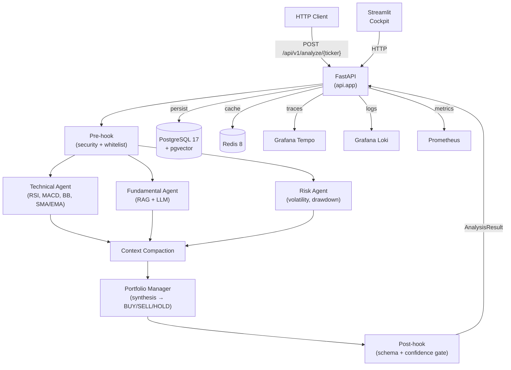

# Apex (MABA-TS)

**Multi-Agent Based Automated Trading System** — 4 specialized LangGraph agents produce BUY/SELL/HOLD signals with confidence scores. Analysis-only; no live trade execution in v1.

[](https://github.com/your-org/apex/actions/workflows/ci.yml)
[](https://www.python.org/)
[](LICENSE)

---

## Architecture



### Key Components

| Layer | Technology | Purpose |
|-------|-----------|---------|
| API | FastAPI 0.136 | REST endpoints, rate limiting, error handling |
| Agents | LangGraph 1.1 | 4-node StateGraph with parallel execution |
| LLM | GPT-5.4 mini | Agent reasoning (configurable) |
| Embeddings | Nomic Embed Text V2 | RAG pipeline, 768-dim, pgvector cosine search |
| Database | PostgreSQL 17 + pgvector | OHLCV, analysis runs, agent decisions, embeddings |
| Cache | Redis 8 | LLM response cache, circuit breaker state, DLQ |
| Frontend | Streamlit 1.56 | AI market intelligence cockpit |
| Observability | OTel + Grafana LGTM | Traces, logs, metrics |
| Deployment | K3s v1.34 + Kustomize | ARM64 self-hosted Kubernetes |

---

## Installation

### Prerequisites

- Python 3.13
- [uv](https://docs.astral.sh/uv/) package manager
- Docker + Docker Compose
- (Optional) K3s for production deployment

### Local Development

```bash
# 1. Clone and install dependencies
git clone https://github.com/your-org/apex.git
cd apex
uv sync

# 2. Start infrastructure (PostgreSQL, Redis, Grafana LGTM)
docker compose -f docker-compose.dev.yml up -d

# 3. Run database migrations
uv run alembic upgrade head

# 4. Seed initial data
uv run python scripts/seed_data.py

# 5. Start the API server
uv run uvicorn apex.api.app:create_app --factory --reload

# 6. Start the Streamlit frontend (separate terminal)
uv run streamlit run src/apex/frontend/app.py
```

### Environment Variables

Copy `.env.example` to `.env` and configure:

```bash
# Database
POSTGRES_USER=apex
POSTGRES_PASSWORD=apex
POSTGRES_HOST=localhost
POSTGRES_PORT=5432
POSTGRES_DB=apex

# Redis
REDIS_URL=redis://localhost:6379/0

# LLM
OPENAI_API_KEY=sk-...
LLM_MODEL=gpt-4o-mini
LLM_DAILY_BUDGET_USD=5.0

# Alpaca (market data)
ALPACA_API_KEY=...
ALPACA_SECRET_KEY=...

# Embeddings
EMBEDDING_MODEL=nomic-embed-text-v2
EMBEDDING_DIM=768

# LangSmith (optional tracing)
LANGCHAIN_API_KEY=...
LANGCHAIN_PROJECT=apex
```

---

## Development Workflow

```bash
# Run all checks (ruff + mypy + pytest)
make check

# Run only tests
uv run pytest

# Run E2E tests (requires Docker)
uv run pytest tests/e2e/ -v

# Run linter
uv run ruff check src/ tests/

# Run type checker
uv run mypy src/

# Format code
uv run ruff format src/ tests/
```

---

## API Reference

### Health

| Method | Path | Description |
|--------|------|-------------|
| GET | `/health` | Liveness probe — always 200 |
| GET | `/ready` | Readiness probe — 503 if deps unavailable |

### Analysis

| Method | Path | Description |
|--------|------|-------------|
| POST | `/api/v1/analyze/{ticker}` | Run 4-agent workflow, return BUY/SELL/HOLD |
| GET | `/api/v1/ohlcv/{ticker}` | Return OHLCV bars (real DB or synthetic fallback) |

#### Example: Analyze AAPL

```bash
curl -X POST http://localhost:8000/api/v1/analyze/AAPL
```

```json
{
  "ticker": "AAPL",
  "signal": "BUY",
  "confidence": 0.72,
  "summary": {
    "usage_summary": {"tokens_in": 1200, "tokens_out": 340, "cost_usd": 0.0012},
    "agent_outputs": { "technical": {...}, "fundamental": {...}, "risk": {...} }
  },
  "total_tokens": 1540,
  "cost_usd": 0.0012,
  "status": "completed"
}
```

---

## Deployment

See [docs/DEPLOYMENT_RUNBOOK.md](docs/DEPLOYMENT_RUNBOOK.md) for the full step-by-step guide.

### Quick K3s Deploy

```bash
# Build and push multi-arch image
docker buildx build --platform linux/amd64,linux/arm64 \
  -t ghcr.io/your-org/apex:latest --push .

# Apply to K3s cluster
kubectl apply -k k8s/overlays/production/
```

---

## Project Structure

```
apex/
├── src/apex/
│   ├── api/            # FastAPI app, routes, middleware
│   ├── agents/         # LangGraph nodes, workflow, hooks, resilience
│   ├── core/           # Config, logging, constants, exceptions
│   ├── domain/         # Pydantic domain models and value objects
│   ├── frontend/       # Streamlit cockpit (6 pages + components)
│   ├── ingestion/      # Alpaca + yfinance market data clients
│   ├── infrastructure_layer/  # SQLAlchemy ORM models, DB/Redis factories
│   └── services/       # LLM client, cost guard, cache, RAG, DLQ, lock
├── tests/
│   ├── unit/           # Fast unit tests (no I/O)
│   ├── integration/    # Tests with real containers
│   └── e2e/            # Full pipeline E2E tests
├── migrations/         # Alembic async migrations
├── k8s/                # Kustomize base + overlays
├── scripts/            # Backup, restore, seed scripts
└── docs/               # ADRs, deployment runbook
```

---

## ADRs

- [ADR-001: LangGraph for agent orchestration](docs/adr/ADR-001-langgraph.md)
- [ADR-002: PostgreSQL + pgvector for data and embeddings](docs/adr/ADR-002-postgresql-pgvector.md)
- [ADR-003: Monolith-first architecture](docs/adr/ADR-003-monolith-first.md)
- [ADR-004: Redis 8 over Redis Stack](docs/adr/ADR-004-redis-8.md)

---

## License

MIT
