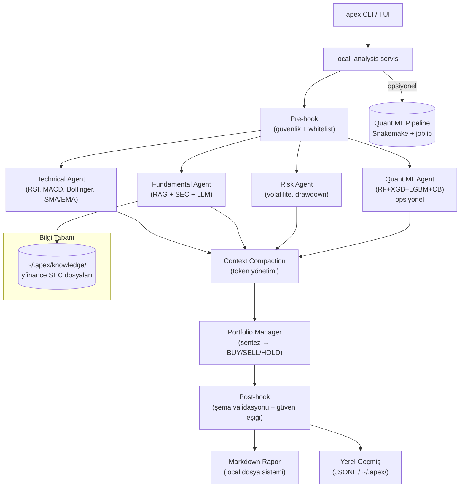

# Apex Terminal

> **Yerel-first çoklu-ajan piyasa araştırma kokpiti — terminalinde çalışır.**

[](https://github.com/EnesDemir143/apex/actions/workflows/ci.yml)
[](https://www.python.org/)
[](LICENSE)
[](https://langchain-ai.github.io/langgraph/)
[](https://textual.textualize.io/)

<p align="center">
  
  <br>
  <em>4 LangGraph ajanı AAPL'yi analiz ediyor — Technical, Fundamental, Risk, Portfolio Manager</em>
</p>

---
<p align="center"><a href="README.md"><u>English</u> →</a></p>
---

## Genel Bakış

Apex, tamamen terminalinizde çalışan **yerel-first, çoklu-ajan piyasa araştırma kokpitidir**. Dört uzman **LangGraph ajanını** — Technical, Fundamental, Risk ve Portfolio Manager — orchestre ederek hisse senetlerini analiz eder ve BUY/SELL/HOLD sinyalleri üretir. Tüm ajanlar paralel çalışır, opsiyonel ensemble ML ve SEC dosyaları üzerinden RAG desteği sunar.

Bulut yok, sunucu yok, Docker gerekmez. Sadece terminaliniz ve bir OpenAI API anahtarı.

### Neden Apex?

| Yetenek | Ne gösterir |
|---------|-------------|
| **Çoklu-Ajan Orchestrasyonu** | LangGraph StateGraph ile paralel yürütme, context compaction, checkpoint persistence |
| **Ensemble ML Pipeline** | 4-model ensemble (RF + XGBoost + LightGBM + CatBoost) + RidgeCV stacking — Snakemake eğitim pipeline'ı |
| **SEC Dosyaları ile RAG** | 10-K/10-Q raporlarını yfinance ile indirir, markdown'a çevirir, local knowledge retrieval ile sunar |
| **Resilience Pattern'lar** | Circuit breaker, kural tabanlı fallback, exponential backoff retry, dead letter queue |
| **Terminal UI** | Mum grafikleri, command palette, gerçek zamanlı ajan progress gösterimi |
| **Yerel-First Mimari** | Sunucu yok, veritabanı yok — sıfır altyapı ile çalışır |

---

<p align="center">
  
  <br>
  <em>Komut satırından tek-sefer analiz</em>
</p>

---

## Ekran Görüntüleri

| | |
|---|---|
|  |  |
| Quant ML sinyalli analiz sonucu | Terminal-native mum grafiği |
|  |  |
| Ajan yürütme sırasında TUI | CLI tek-sefer analiz |

---

## Hızlı Başlangıç

```bash
# 1. Kopyala ve kur
git clone https://github.com/EnesDemir143/apex.git
cd apex
uv sync

# 2. API anahtarlarını ayarla
cp .env.example .env
# .env dosyasını düzenle: OPENAI_API_KEY yaz

# 3. Terminal kokpitini başlat
uv run apex

# — ya da tek-sefer analiz —
uv run apex analyze AAPL
```

PostgreSQL, Redis, Docker veya web sunucusu gerekmez. Apex tamamen local çalışır.

---

## Mimari



### Ajan Yürütme Akışı

1. **Pre-hook**: Ticker whitelist kontrolü, prompt injection taraması
2. **Paralel Yürütme**: Technical, Fundamental, Risk ve Quant ajanları eşzamanlı çalışır
3. **Context Compaction**: Token limiti aşıldığında ajan çıktılarını sıkıştırır
4. **Portfolio Manager**: Tüm çıktıları sentezler → nihai karar
5. **Post-hook**: Çıktı şemasını doğrular, gerekirse kural tabanlı fallback uygular

### Temel Bileşenler

| Katman | Teknoloji | Amaç |
|--------|-----------|------|
| **CLI / TUI** | Typer + Textual | Slash komutları, grafik paneli, piyasa verisi |
| **Ajan Orchestrasyonu** | LangGraph 1.1 | 4 düğümlü StateGraph, paralel yürütme, checkpoint |
| **LLM** | GPT-4o-mini / ayarlanabilir | Ajan karar mekanizması |
| **Ensemble ML** | scikit-learn + xgboost + lightgbm + catboost | Opsiyonel 4-model quant sinyali (RidgeCV stacking) |
| **Eğitim Pipeline'ı** | Snakemake | Tekrarlanabilir ML eğitimi |
| **RAG** | Local knowledge + yfinance SEC | 10-K/10-Q raporlarından bağlam |
| **Piyasa Verisi** | Alpaca + yfinance fallback | OHLCV verileri |
| **Yerel Geçmiş** | JSONL + dosya sistemi | Analiz kayıtları — sıfır altyapı |

---

## Özellikler

### Çoklu-Ajan Orchestrasyonu

Dört uzman LangGraph ajanı, her biri kendi system prompt'u ile:

| Ajan | Rol | Analiz |
|------|-----|--------|
| **Technical** | Disiplinli teknik analist | RSI, MACD, Bollinger, SMA/EMA, hacim analizi |
| **Fundamental** | Muhafazakar değer analisti | SEC raporlarından RAG bağlamı, finansal metrikler |
| **Risk** | Risk yöneticisi | Volatilite, drawdown, risk skoru |
| **Portfolio Manager** | Sentez süpervizörü | Tüm sinyalleri birleştirir → BUY/SELL/HOLD |

**Gerçek zamanlı progress takibi** — her ajan tamamlandığında event log'da görünür.

### Ensemble ML Quant Ajanı (Opsiyonel)

**4-model stacking ensemble** + RidgeCV meta-learner:

- **Temel modeller**: Random Forest, XGBoost, LightGBM, CatBoost
- **Meta-learner**: RidgeCV ile TimeSeriesSplit çapraz doğrulama
- **23 teknik feature**: Getiri, volatilite, RSI, MACD, Bollinger, SMA oranları, hacim, rolling istatistikler
- **Eğitim**: `snakemake -s Snakefile_train all --cores 4`
- **Model persistence**: joblib → `models/quant/*.pkl`

TUI'de aktifleştir: `/quant on` → `/analyze AAPL`

### SEC Dosyaları ile RAG

```bash
# Tüm takip edilen ticker'lar için son 10-K/10-Q dosyalarını indir
uv run apex sec-fetch all

# İndirilen dosyalar otomatik olarak Fundamental Agent'a sunulur
ls ~/.apex/knowledge/AAPL/
# 10-K_20251031.md  10-Q_20260130.md  10-Q_20260501.md
```

SEC dosyaları temiz markdown'a dönüştürülür ve local knowledge retrieval sistemi üzerinden sunulur. Veritabanı veya embedding sunucusu gerekmez.

### Terminal UI (Textual)

- **Slash komut paleti**: `/select`, `/analyze`, `/chart`, `/quant`, `/lang`, `/prompt`, `/help`
- **Gerçek zamanlı progress**: Her ajan tamamlanınca event log'da canlı gösterim
- **Mum grafikleri**: Terminal-native grafik, RSI/MACD alt panelleri, crosshair inceleme, zoom/pan
- **Piyasa paneli**: Canlı OHLCV, indikatör özeti, kaynak takibi
- **Ajan prompt'ları**: `/prompt technical "momentum odaklı"` — ajan bazında özelleştirme

### Resilience & Güvenlik

- **Pre-hook**: Input canonicalization, prompt injection tespiti, ticker whitelist
- **Post-hook**: Çıktı şema validasyonu, güven eşiği kontrolü
- **Circuit breaker**: Ardışık LLM hatalarında devre dışı kalma, kural tabanlı fallback
- **LLM bütçe koruması**: Günlük maliyet takibi, bütçe aşımında otomatik durdurma
- **Kural tabanlı fallback**: RSI < 30 → BUY, RSI > 70 → SELL, arada → HOLD

### Observability

- **LangSmith tracing**: Her ajan çağrısı ticker + agent_name ile izlenir
- **Maliyet takibi**: Analiz başına token kullanımı ve USD maliyeti

---

## CLI Referansı

```bash
uv run apex                    # Terminal kokpitini başlat (varsayılan)
uv run apex analyze AAPL       # Tek-sefer analiz
uv run apex analyze AAPL --save-report  # Markdown rapor olarak kaydet
uv run apex history            # Kayıtlı analizleri listele
uv run apex report AAPL --latest # Son raporu görüntüle
uv run apex sec-fetch AAPL     # SEC dosyalarını bilgi tabanına indir
uv run apex sec-fetch all      # Tüm whitelist ticker'ları indir
```

### TUI Slash Komutları

| Komut | Açıklama |
|-------|----------|
| `/select AAPL` | Seçili ticker'ı değiştir |
| `/analyze AAPL` | Ticker için analiz çalıştır |
| `/chart AAPL` | Terminal grafiğini aç |
| `/quant on` | Quant ML ajanını aktifleştir |
| `/lang English` | Rapor dilini değiştir |
| `/prompt` | Ajan talimatlarını görüntüle/değiştir |
| `/setup` | Konfigürasyon panelini aç |
| `/team` | Ajan ekranını görüntüle |
| `/help` | Tüm komutları listele |

---

## Kurulum

### Gereksinimler

- Python 3.13+
- `uv` (Python paket yöneticisi) — `curl -LsSf https://astral.sh/uv/install.sh | sh`
- OpenAI API anahtarı

### Adımlar

```bash
# Kopyala
git clone https://github.com/EnesDemir143/apex.git
cd apex

# Temel bağımlılıkları kur
uv sync

# (Opsiyonel) Quant ML bağımlılıklarını kur
uv sync --group quant

# (Opsiyonel) Ensemble modellerini eğit
bash scripts/train_models.sh
# veya: snakemake -s Snakefile_train all --cores 4

# Ortam değişkenlerini ayarla
cp .env.example .env
# .env dosyasını düzenle:
#   OPENAI_API_KEY=sk-...            (zorunlu)
#   ALPACA_API_KEY=...               (opsiyonel — yfinance fallback çalışır)

# Başlat
uv run apex
```

### Geliştirme

```bash
# Tüm kontrolleri çalıştır
make check

# Testleri çalıştır
uv run pytest tests/unit/

# Format ve lint
uv run ruff format src/ tests/
uv run ruff check src/ tests/

# Tip kontrolü
uv run mypy src/
```

---

## Proje Yapısı

```
apex/
├── src/apex/
│   ├── cli/                    # Typer CLI giriş noktası + komutlar
│   ├── tui/                    # Textual terminal kokpiti
│   ├── agents/                 # LangGraph düğümleri, workflow, hooks
│   │   ├── technical.py        #   Teknik Ajan
│   │   ├── fundamental.py      #   Fundamental Ajan (RAG + LLM)
│   │   ├── risk.py             #   Risk Ajanı
│   │   ├── portfolio_manager.py#   Portföy Yöneticisi (sentez)
│   │   ├── quant.py            #   Quant ML Ajanı (ensemble)
│   │   ├── workflow.py         #   StateGraph + streaming
│   │   └── state.py            #   AgentState TypedDict
│   ├── ml/                     # Quant ML inference paketi
│   ├── services/               # Temel servisler
│   ├── reports/                # Markdown rapor üretimi
│   ├── core/                   # Konfigürasyon, loglama
│   ├── domain/                 # Pydantic domain modelleri
│   ├── ingestion/              # Alpaca + yfinance veri client'ları
│   ├── api/                    # FastAPI (opsiyonel)
│   └── frontend/               # Streamlit (opsiyonel)
├── tests/                      # 193 birim test
├── models/quant/               # Eğitilmiş ensemble modeller
├── Snakefile_train             # Snakemake eğitim pipeline'ı
└── docs/                       # ADR'ler, deployment rehberi
```

---

## Opsiyonel: Web Stack (FastAPI + Streamlit)

Sunucu stack'i CV sergilemesi için korunmuştur. Yerel TUI kullanımı için gerekli değildir.

```bash
docker compose -f docker-compose.dev.yml up -d
uv run alembic upgrade head
uv run uvicorn apex.api.app:create_app --factory --reload
```

Detaylar: [docs/WEB_STACK_REVIVAL_GUIDE.md](docs/WEB_STACK_REVIVAL_GUIDE.md)

---

## Ortam Değişkenleri

| Değişken | Zorunlu | Varsayılan | Açıklama |
|----------|---------|------------|----------|
| `OPENAI_API_KEY` | Evet | — | OpenAI API anahtarı |
| `LLM_MODEL` | Hayır | `gpt-4o-mini` | LLM model adı |
| `LLM_DAILY_BUDGET_USD` | Hayır | `5.0` | Günlük LLM bütçe limiti |
| `ALPACA_API_KEY` | Hayır | — | Alpaca piyasa verisi (yfinance çalışır) |
| `LANGCHAIN_API_KEY` | Hayır | — | LangSmith tracing |
| `EMBEDDING_MODEL` | Hayır | `nomic-embed-text-v2` | RAG embedding modeli |

---

## Lisans

MIT

---

Python, LangGraph, Textual, scikit-learn ve yfinance ile oluşturulmuştur.
